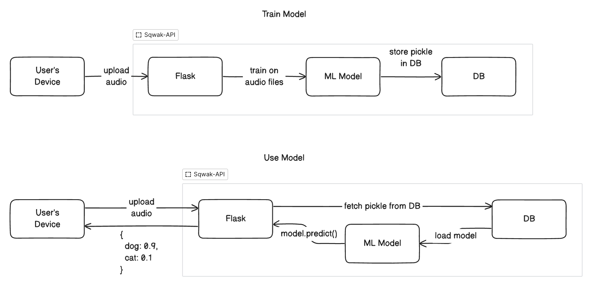

### Sqwak API:

Backend for [sqwak-app](https://github.com/dharness/sqwak-app).
Provides API access for:

- create and delete users
- create, edit, and delete apps
- add classes to apps
- train ML models
- publish models to a public endpoint
- predict using those models via API call

#### High Level Design:

<p><a target="_blank" href="https://app.eraser.io/workspace/1k0UICeFcYJiaY16UIHC?origin=share" id="edit-in-eraser-github-link"></a></p>

<!--- Eraser file: https://app.eraser.io/workspace/1k0UICeFcYJiaY16UIHC --->



#### Local Development:

1. Start a postgres server locally

2. Create a `.env` with the following keys:

```
SQLALCHEMY_DATABASE_URI=<postgres_uri>
```

3. Install ffmpeg, if you're on a mac, run `brew install ffmpeg`

4. Install dependencies and start the app:

```
pip install -r requirements.txt
make dev
```
